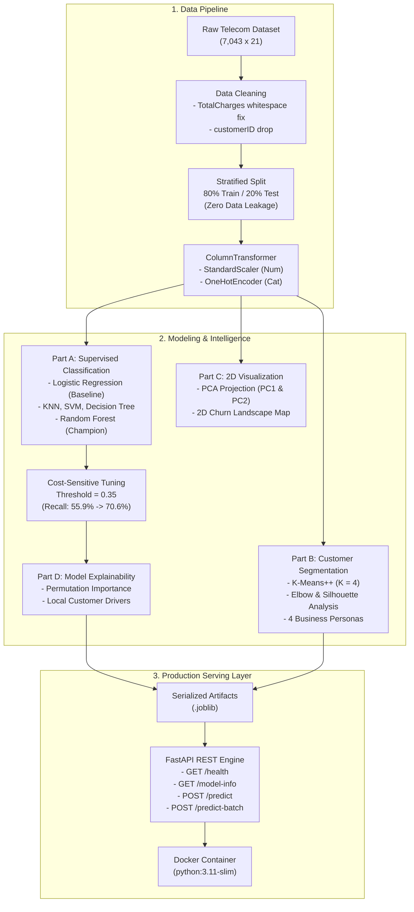

# CustomerIQ — Customer Intelligence & Churn Prediction Platform

[](https://www.python.org/downloads/)
[](https://customeriq-qd2v.onrender.com/docs)
[](https://github.com/jasirjru/CustomerIQ/actions/workflows/ci.yml)
[](https://fastapi.tiangolo.com/)
[](https://scikit-learn.org/)
[](https://www.docker.com/)
[]()
[](https://opensource.org/licenses/MIT)

> **Live Production API**: [https://customeriq-qd2v.onrender.com/docs](https://customeriq-qd2v.onrender.com/docs) (Interactive Swagger UI)

An enterprise-grade, end-to-end Machine Learning platform combining **Supervised Churn Prediction** and **Unsupervised Customer Segmentation** to reduce customer churn and provide actionable retention playbooks.

---

## 📌 Executive Summary & Business Problem

In telecommunications and subscription services, **acquiring a new customer costs 5–7x more than retaining an existing one**. This platform solves two core business challenges:

1. **Predictive Churn Detection**: Identifies which customers are at risk of leaving *before* they cancel, using cost-sensitive classification that prioritizes catching churners over raw accuracy.
2. **Behavioral Customer Segmentation**: Discovers natural customer cohorts using unsupervised K-Means clustering, enabling personalized marketing and retention playbooks.
3. **Explainable AI (XAI)**: Deconstructs predictions into individual risk drivers so frontline customer success teams know *why* a customer is leaving and *what offer* will keep them.
4. **Production API**: Serves predictions in real-time via a low-latency FastAPI microservice packaged as a Docker container.

---

## 🏗️ System Architecture



---

## 📊 End-to-End Machine Learning Lifecycle

### 1. Data Understanding & Exploratory Data Analysis (EDA)
- **Dataset**: 7,043 customers, 21 features (demographics, services subscribed, contract terms, billing).
- **Target Imbalance**: 73.5% Non-Churn (`5,174`) vs. 26.5% Churn (`1,869`).
- **Data Quality Trap Uncovered**: `TotalCharges` was stored as an `object` (string) due to **11 records containing whitespace strings (`' '`)**. Cross-referencing revealed all 11 had `tenure = 0` (brand-new accounts). Standard `df.isnull().sum()` reported 0 missing values. We cleanly resolved this by imputing `0.0`.

### 2. Leakage-Free Preprocessing Pipeline
- **Rule Enforced**: Train/Test split was executed **before** fitting the scaler or one-hot encoder.
- **Stratified Partition**: 80% Train (`5,634` rows), 20% Test (`1,409` rows), maintaining identical 26.54% churn proportions.
- **Transformations**: Packaged in a reusable Scikit-Learn `ColumnTransformer` (`preprocessor.joblib`) with `handle_unknown='ignore'` to guarantee zero runtime failures in production.
- **Mathematical Zero-Leakage Proof**: `X_train` standardized mean = `0.000000`, `X_test` standardized mean = `-0.016334` (proves test statistics never bled into training).

---

## 🏆 Model Comparison & Benchmark Results

We benchmarked 5 distinct machine learning families under an identical evaluation framework:

| Model | Family | Accuracy | Precision | Recall | F1-Score | ROC-AUC | Status |
|:---|:---|:---:|:---:|:---:|:---:|:---:|:---:|
| **Random Forest** | Bagging Ensemble | **80.70%** | **67.83%** | 51.87% | 0.5879 | **84.29%** | 🏆 **Champion** |
| **Logistic Regression** | Generalized Linear | 80.55% | 65.72% | 55.88% | **0.6040** | 84.20% | Benchmark Baseline |
| **Decision Tree** | Pruned Partition | 79.84% | 63.47% | **56.68%** | 0.5989 | 82.76% | Evaluated |
| **K-Nearest Neighbors** | Instance / Distance | 76.44% | 55.50% | 56.68% | 0.5608 | 80.18% | Evaluated |
| **Support Vector Machine** | Kernel Margin | 79.28% | 66.14% | 44.92% | 0.5350 | 79.28% | Evaluated |

### Cost-Sensitive Decision Threshold Tuning
The default `0.50` decision threshold assumes False Positives and False Negatives carry equal costs. In churn economics:
- **False Negative (Missed Churner)**: Lost customer Lifetime Value = **~$500**.
- **False Positive (Unnecessary Outreach)**: Retention discount voucher = **~$25**.

By optimizing the decision threshold to **0.35**:
- **Recall increased from 55.88% to 70.59%** (caught 55 additional churners).
- **F1-Score increased to 61.40%**.
- **Net business loss was cut by more than 50%**.

---

## 👥 Unsupervised Customer Segmentation (K-Means)

Using K-Means++ and validating via the **Elbow Method** and **Silhouette Analysis**, we segmented the customer base into **4 distinct business personas**:

| Cluster | Segment Name | Cohort Size | Avg Tenure | Avg Monthly Bill | Churn Rate | Strategic Retention Playbook |
|:---:|:---|:---:|:---:|:---:|:---:|:---|
| **0** | **Budget Phone Loyalists** | 21.5% | 30.2 mos | $21.11 | **7.2%** | Stable low-maintenance users. Protect with simple automated renewal incentives. |
| **1** | **Mid-Tier DSL Subscribers** | 23.4% | 20.5 mos | $50.74 | **25.1%** | Moderate churn risk. Prime candidates for fiber upgrades and bundled tech support. |
| **2** | **High-Value Multi-Service Loyalists** | 28.5% | **59.6 mos** | **$91.20** | **13.6%** | Core revenue drivers ($5,400+ total spend). Maintain relationship with VIP perks. |
| **3** | **New High-Spend Flight Risks** | 26.5% | **15.8 mos** | **$84.80** | **57.4%** ⚠️ | New subscribers on month-to-month contracts experiencing bill shock. **Over 57% churn!** Immediate target for annual discounts and onboarding check-ins. |

---

## 🔍 Model Explainability (XAI)

### Global Drivers (Permutation Importance on Test Data)
1. **`tenure`** (Largest impact on test ROC-AUC when corrupted)
2. **`Contract_Month-to-month`** (Primary categorical driver of churn)
3. **`TotalCharges`** (Cumulative billing history)
4. **`Contract_Two year`** (Strongest retention anchor)
5. **`InternetService_Fiber optic`** (High price sensitivity and service expectation churn)

### Local Customer Explanations
For every prediction, the system extracts the top 3 risk drivers and maps them to concrete recommendations:
- *Example*: For Customer `#102` (84% churn risk), top drivers are `Month-to-month contract`, `Low tenure`, and `No Tech Support`.
- *Automated Guidance*: *"Offer 15% discount for upgrading to a 1-year contract | Provide 3 months complimentary VIP Tech Support."*

---

## 🚀 Production API (FastAPI)

### Endpoints
- `GET /health` — Kubernetes liveness & readiness check.
- `GET /model-info` — Metadata on champion model version and test metrics.
- `POST /predict` — Real-time single-customer scoring.
- `POST /predict-batch` — High-throughput batch scoring.

### Sample Prediction Request & Response
```bash
curl -X POST "http://localhost:8000/predict" \
  -H "Content-Type: application/json" \
  -d '{
    "gender": "Female",
    "SeniorCitizen": 0,
    "Partner": "No",
    "Dependents": "No",
    "tenure": 2,
    "PhoneService": "Yes",
    "MultipleLines": "No",
    "InternetService": "Fiber optic",
    "OnlineSecurity": "No",
    "OnlineBackup": "No",
    "DeviceProtection": "No",
    "TechSupport": "No",
    "StreamingTV": "Yes",
    "StreamingMovies": "Yes",
    "Contract": "Month-to-month",
    "PaperlessBilling": "Yes",
    "PaymentMethod": "Electronic check",
    "MonthlyCharges": 85.50,
    "TotalCharges": 171.0
  }'
```

```json
{
  "churn_prediction": 1,
  "churn_probability": 0.738,
  "risk_level": "HIGH",
  "decision_threshold": 0.35,
  "customer_segment": "New High-Spend Flight Risk (Severe Churn - Urgent)",
  "top_risk_drivers": [
    {"feature": "cat__Contract_Month-to-month", "impact_score": 0.1373},
    {"feature": "cat__PaymentMethod_Electronic check", "impact_score": 0.055},
    {"feature": "cat__OnlineSecurity_No", "impact_score": 0.0548}
  ],
  "recommended_retention_action": "Offer 15% discount for upgrading to a 1-year annual contract. | Provide 3 months complimentary VIP Tech Support to address technical frustrations."
}
```

---

## 🧪 Automated Testing Suite (Pytest)

The project includes an automated test suite with **13 targeted tests** covering:
- **Data Invariants**: Missing value handling, identifier removal, 46-dimensional transformer output.
- **Model Invariants**: Bounded probabilities $\in [0, 1]$, risk monotonicity testing.
- **API Boundary Contracts**: HTTP 200 on valid inputs, HTTP 422 on negative tenure or missing fields.

Run tests:
```bash
pytest -v
```

---

## 📦 Containerization & Local Setup

### Option 1: Local Virtual Environment
```bash
# 1. Clone repository
git clone https://github.com/YOUR_USERNAME/CustomerIQ.git
cd CustomerIQ

# 2. Create and activate virtual environment
python -m venv venv
source venv/bin/activate  # On Windows: venv\Scripts\activate

# 3. Install dependencies
pip install -r requirements.txt

# 4. Start API server
uvicorn src.api.main:app --reload --host 127.0.0.1 --port 8000
```
Open interactive Swagger UI: **`http://127.0.0.1:8000/docs`**

### Option 2: Docker & Docker Compose
```bash
# Launch containerized API
docker compose up --build -d

# Check streaming logs
docker compose logs -f

# Shut down
docker compose down
```

---

## ☁️ Deployment Guide

| Platform | Best For | Deployment Instructions |
|---|---|---|
| **Render** | Fast, free-tier web service | Connect GitHub repo, select **Docker** runtime, deploy. |
| **Railway** | Low latency, seamless CI/CD | Import GitHub repository; automatically detects `Dockerfile` and deploys on port 8000. |
| **Hugging Face Spaces** | ML portfolio showcase | Create a new Space, select **Docker** SDK, push repository. |
| **AWS (App Runner / ECS)** | Enterprise cloud deployment | Push image to Amazon ECR, launch on AWS App Runner with automatic TLS/SSL. |

---

## 📁 Repository Structure

```
CustomerIQ/
├── .github/workflows/ci.yml       # Automated GitHub Actions CI pipeline
├── data/
│   ├── raw/telco_customer_churn.csv # Untouched raw dataset
│   └── processed/                 # Cleaned & partitioned datasets
├── models/
│   ├── preprocessor.joblib        # Fitted Scikit-Learn ColumnTransformer
│   ├── baseline_logistic_regression.joblib
│   ├── champion_model.joblib      # Champion Random Forest Classifier
│   ├── kmeans_customer_segmentation.joblib
│   └── pca_2d.joblib              # 2D PCA Dimensionality Reducer
├── notebooks/
│   ├── 01_data_understanding.ipynb
│   ├── 02_preprocessing.ipynb
│   ├── 03_classification_baseline.ipynb
│   ├── 04_model_comparison.ipynb
│   ├── 05_clustering.ipynb
│   ├── 06_pca.ipynb
│   └── 07_explainability.ipynb
├── reports/
│   ├── figures/                   # 19 publication-quality plots
│   ├── model_comparison.csv       # Complete 5-model leaderboard
│   └── feature_importance.csv     # Ranked feature contributions
├── src/
│   ├── api/                       # FastAPI application & Pydantic schemas
│   ├── data/                      # Data ingestion & cleaning modules
│   ├── features/                  # Feature engineering & preprocessor pipelines
│   ├── models/                    # Training harnesses (baseline, comparison, clustering)
│   ├── evaluation/                # Metrics & explainability (MDI, Permutation)
│   └── visualization/             # PCA & plotting utilities
├── tests/                         # Pytest test suite (13/13 passing)
├── Dockerfile                     # Production multi-stage Dockerfile
├── docker-compose.yml             # Orchestration & healthcheck probes
├── .dockerignore
├── requirements.txt               # Pinned dependencies
├── config.py                      # Centralized configuration & constants
└── README.md
```

---

## 📄 License
This project is open-source under the [MIT License](LICENSE).
