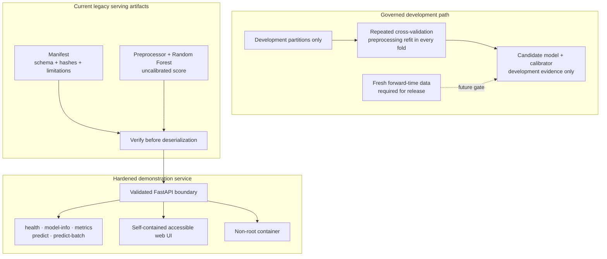

# CustomerIQ — Customer Intelligence & Churn Prediction Platform

[](https://www.python.org/downloads/)
[](https://customeriq-qd2v.onrender.com/)
[](https://customeriq-qd2v.onrender.com/docs)
[](https://github.com/jasirjru/CustomerIQ/actions/workflows/ci.yml)
[](https://fastapi.tiangolo.com/)
[](https://scikit-learn.org/)
[](https://www.docker.com/)
[]()
[](https://opensource.org/licenses/MIT)

> 🚀 **Live demonstration**: [https://customeriq-qd2v.onrender.com/](https://customeriq-qd2v.onrender.com/) (not release-approved for real customer decisions)
> 📖 **OpenAPI schema**: [https://customeriq-qd2v.onrender.com/docs](https://customeriq-qd2v.onrender.com/docs)

CustomerIQ v1.1 serves a legacy Random Forest churn score through a manifest-verified API with strict request validation and a reserved final-test protocol.

> **Release-status warning:** serving scores are not calibrated probabilities. The deployed `0.35` threshold is retained as `legacy_unapproved`; the development-only `0.135039…` threshold is not deployed. No local attribution or causal retention recommendation is currently available.

---

## 📌 Executive Summary & Business Problem

CustomerIQ demonstrates four foundations required for governed churn decision support:

1. **Churn scoring**: returns the estimator's positive-class score unchanged.
2. **Strict contracts**: rejects unknown categories, extra fields, inconsistent telecom services, oversized batches, and non-finite numbers.
3. **Honest metadata**: exposes artifact hashes, limitations, uncalibrated status, and threshold provenance through `/model-info`.
4. **Protected serving**: verifies artifacts before deserialization and applies bounded request, rate, CORS, and safe-error controls.

---

## 🏗️ System Architecture



---

## 📊 End-to-End Machine Learning Lifecycle

### 1. Data Understanding & Exploratory Data Analysis (EDA)
- **Dataset**: 7,043 customers, 21 features (demographics, services subscribed, contract terms, billing).
- **Target Imbalance**: 73.5% Non-Churn (`5,174`) vs. 26.5% Churn (`1,869`).
- **Data Quality Trap Uncovered**: `TotalCharges` was stored as an `object` (string) due to **11 records containing whitespace strings (`' '`)**. Cross-referencing revealed all 11 had `tenure = 0` (brand-new accounts). Standard `df.isnull().sum()` reported 0 missing values. We cleanly resolved this by imputing `0.0`.

### 2. Evaluation and preprocessing protocol
- Candidate comparison uses repeated stratified cross-validation on the training partition.
- Threshold experiments use validation data only.
- The final-test partition is sealed during development and has not been evaluated for v1.1.
- The serving artifacts are legacy artifacts; their original training commit, package versions, and dataset hash were not recorded. The manifest reports those provenance gaps explicitly.

---

## 🏆 Model Comparison & Benchmark Results

The table below is legacy historical output and is not an independent v1.1 release estimate. Those rows were previously exposed, so fresh external data is required for an unbiased final performance estimate.

| Model | Family | Accuracy | Precision | Recall | F1-Score | ROC-AUC | Status |
|:---|:---|:---:|:---:|:---:|:---:|:---:|:---:|
| **Random Forest** | Bagging Ensemble | **80.70%** | **67.83%** | 51.87% | 0.5879 | **84.29%** | 🏆 **Champion** |
| **Logistic Regression** | Generalized Linear | 80.55% | 65.72% | 55.88% | **0.6040** | 84.20% | Benchmark Baseline |
| **Decision Tree** | Pruned Partition | 79.84% | 63.47% | **56.68%** | 0.5989 | 82.76% | Evaluated |
| **K-Nearest Neighbors** | Instance / Distance | 76.44% | 55.50% | 56.68% | 0.5608 | 80.18% | Evaluated |
| **Support Vector Machine** | Kernel Margin | 79.28% | 66.14% | 44.92% | 0.5350 | 79.28% | Evaluated |

### Decision-threshold status
The serving threshold remains `0.35` only for backward compatibility and is labeled `legacy_unapproved`. The v1.1 development experiment used illustrative false-negative/false-positive costs of 500/100 and produced `0.135039…`; that value is explicitly non-deployable until business costs, operational capacity, sensitivity analysis, and a release freeze are approved.

---

## 👥 Historical exploratory segmentation (K-Means)

Legacy exploratory work grouped the historical dataset into four descriptive clusters. These associations are not causal treatment recommendations, are not returned by the v1.1 API, and require fresh-data validation before operational use.

| Cluster | Descriptive legacy label | Cohort size | Avg tenure | Avg monthly bill | Observed churn rate |
|:---:|:---|:---:|:---:|:---:|:---:|
| **0** | Budget phone users | 21.5% | 30.2 mos | $21.11 | 7.2% |
| **1** | Mid-tier DSL users | 23.4% | 20.5 mos | $50.74 | 25.1% |
| **2** | Multi-service users | 28.5% | 59.6 mos | $91.20 | 13.6% |
| **3** | Newer high-spend users | 26.5% | 15.8 mos | $84.80 | 57.4% |

---

## 🔍 Model Explainability (XAI)

The manifest contains the Random Forest's global mean-decrease-in-impurity feature importance. This is a population-level model summary, not a per-customer explanation and not a causal effect.

Local attribution has not been implemented or validated. Prediction responses therefore return `explanation_status: "not_available"`, an empty `top_risk_drivers` list, and no retention recommendation.

---

## 🚀 Hardened demonstration API (FastAPI)

### Endpoints
- `GET /health` — Process and verified-artifact health check.
- `GET /model-info` — Verified artifact metadata, provenance gaps, and release limitations.
- `GET /metrics` — Authenticated, payload-free Prometheus metrics.
- `POST /predict` — Real-time single-customer scoring.
- `POST /predict-batch` — High-throughput batch scoring.

### Sample Prediction Request & Response
```bash
curl -X POST "http://localhost:8000/predict" \
  -H "Content-Type: application/json" \
  -H "X-API-Key: $CUSTOMERIQ_API_KEY" \
  -d '{
    "gender": "Female",
    "SeniorCitizen": 0,
    "Partner": "No",
    "Dependents": "No",
    "tenure": 2,
    "PhoneService": "Yes",
    "MultipleLines": "No",
    "InternetService": "Fiber optic",
    "OnlineSecurity": "No",
    "OnlineBackup": "No",
    "DeviceProtection": "No",
    "TechSupport": "No",
    "StreamingTV": "Yes",
    "StreamingMovies": "Yes",
    "Contract": "Month-to-month",
    "PaperlessBilling": "Yes",
    "PaymentMethod": "Electronic check",
    "MonthlyCharges": 85.50,
    "TotalCharges": 171.0
  }'
```

```json
{
  "churn_prediction": 1,
  "churn_probability": 0.738,
  "risk_level": "REVIEW",
  "decision_threshold": 0.35,
  "threshold_status": "legacy_unapproved",
  "model_version": "legacy-rf-09608a080c72",
  "calibration_status": "not_fitted",
  "explanation_status": "not_available",
  "top_risk_drivers": [],
  "recommended_retention_action": null,
  "customer_segment": null
}
```

---

## 🧪 Automated Testing Suite (Pytest)

The project includes more than 120 Python tests and 14 Chromium desktop/mobile scenarios covering data and model invariants, API boundary and security contracts, artifact integrity, release governance, accessibility, XSS resistance, and responsive behavior.

Run tests:
```bash
pytest -v
```

---

## 📦 Containerization & Local Setup

### Option 1: Local Virtual Environment
```bash
# 1. Clone repository
git clone https://github.com/jasirjru/CustomerIQ.git
cd CustomerIQ

# 2. Create and activate virtual environment
python -m venv venv
source venv/bin/activate  # On Windows: venv\Scripts\activate

# 3. Install dependencies
pip install --require-hashes -r requirements-test.lock

# 4. Start API server
uvicorn src.api.main:app --reload --host 127.0.0.1 --port 8000
```
Open the browser interface at **`http://127.0.0.1:8000/`**, the self-contained API reference at **`http://127.0.0.1:8000/docs`**, and the raw OpenAPI document at **`http://127.0.0.1:8000/openapi.json`**.

### Option 2: Docker & Docker Compose
```bash
# Launch containerized API
export CUSTOMERIQ_API_KEYS="replace-with-a-random-secret-of-at-least-32-characters"
docker compose up --build -d

# Check streaming logs
docker compose logs -f

# Shut down
docker compose down
```

### Option 3: Interactive Streamlit Web Dashboard
```bash
# Launch interactive intelligence dashboard
streamlit run src/dashboard/app.py
```
Open **`http://localhost:8501`** to use the legacy launcher, which links to the FastAPI interface and does not load evaluation datasets.

Production mode requires API-key authentication and fails closed if keys are absent. See `docs/SECURITY.md`, `docs/MODEL_CARD.md`, `docs/OBSERVABILITY.md`, and `docs/RELEASE_RUNBOOK.md` before any release activity.

---

## ☁️ Demonstration deployment options

These targets can host the demonstration service. Deployment alone does not satisfy the release gates in `docs/RELEASE_RUNBOOK.md`.

| Platform | Best For | Deployment Instructions |
|---|---|---|
| **Render** | Fast, free-tier web service | Connect GitHub repo, select **Docker** runtime, deploy. |
| **Railway** | Low latency, seamless CI/CD | Import GitHub repository; automatically detects `Dockerfile` and deploys on port 8000. |
| **Hugging Face Spaces** | ML portfolio showcase | Create a new Space, select **Docker** SDK, push repository. |
| **AWS (App Runner / ECS)** | Enterprise cloud deployment | Push image to Amazon ECR, launch on AWS App Runner with automatic TLS/SSL. |

---

## 📁 Repository Structure

```
CustomerIQ/
├── .github/workflows/ci.yml       # Automated GitHub Actions CI pipeline
├── data/
│   ├── raw/telco_customer_churn.csv # Untouched raw dataset
│   └── processed/                 # Cleaned & partitioned datasets
├── models/
│   ├── preprocessor.joblib        # Fitted Scikit-Learn ColumnTransformer
│   ├── baseline_logistic_regression.joblib
│   ├── champion_model.joblib      # Champion Random Forest Classifier
│   ├── kmeans_customer_segmentation.joblib
│   └── pca_2d.joblib              # 2D PCA Dimensionality Reducer
├── notebooks/
│   ├── 01_data_understanding.ipynb
│   ├── 02_preprocessing.ipynb
│   ├── 03_classification_baseline.ipynb
│   ├── 04_model_comparison.ipynb
│   ├── 05_clustering.ipynb
│   ├── 06_pca.ipynb
│   └── 07_explainability.ipynb
├── reports/
│   ├── figures/                   # 19 publication-quality plots
│   ├── model_comparison.csv       # Complete 5-model leaderboard
│   └── feature_importance.csv     # Ranked feature contributions
├── src/
│   ├── api/                       # FastAPI application & Pydantic schemas
│   ├── dashboard/                 # Streamlit interactive web dashboard
│   │   └── app.py                 # Multi-tab customer intelligence application
│   ├── data/                      # Data ingestion & cleaning modules
│   ├── features/                  # Feature engineering & preprocessor pipelines
│   ├── models/                    # Training harnesses (baseline, comparison, clustering)
│   ├── evaluation/                # Metrics & explainability (MDI, Permutation)
│   └── visualization/             # PCA & plotting utilities
├── tests/                         # Python and browser quality suites
├── Dockerfile                     # Production multi-stage Dockerfile
├── docker-compose.yml             # Orchestration & healthcheck probes
├── .dockerignore
├── requirements.txt               # Pinned dependencies
├── config.py                      # Centralized configuration & constants
└── README.md
```

## 👨‍💻 Author & Engineering Leadership

**Jasir** — *Lead Machine Learning Engineer & System Architect*
- **GitHub**: [@jasirjru](https://github.com/jasirjru)
- **Live Demo**: [customeriq-qd2v.onrender.com](https://customeriq-qd2v.onrender.com/)
- **API Documentation**: [customeriq-qd2v.onrender.com/docs](https://customeriq-qd2v.onrender.com/docs)

---

## 📄 License
This project is open-source under the [MIT License](LICENSE).
Copyright © 2026 Jasir.
